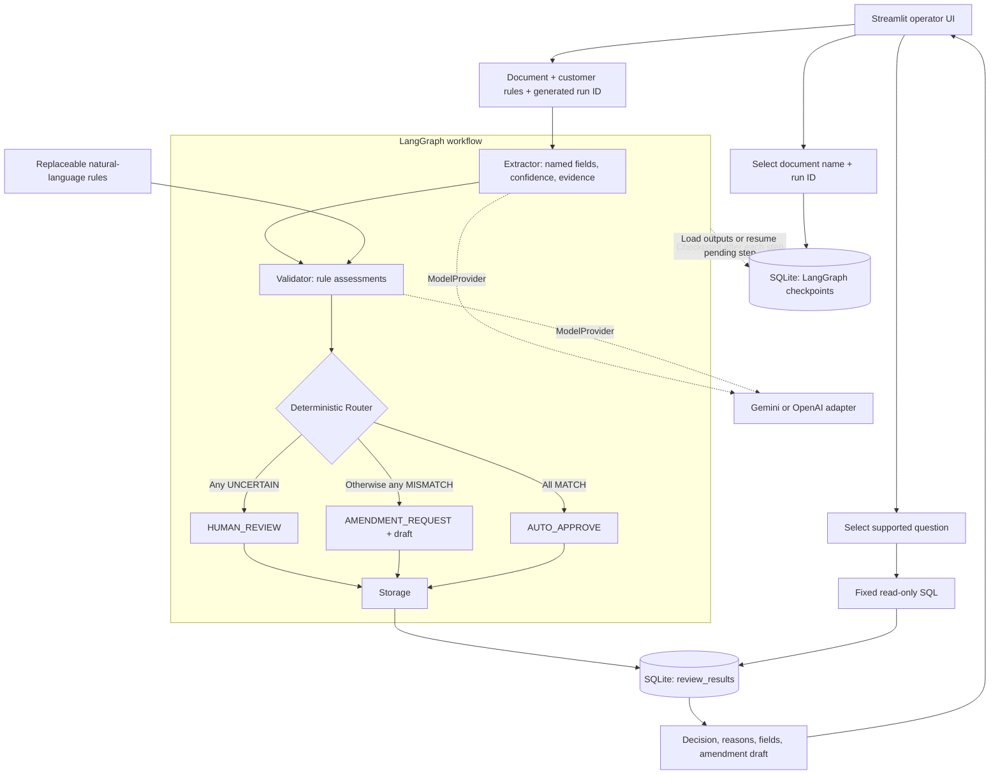

# GoComet Nova

## Run locally

Use Python 3.11+ and a Bash-compatible shell. Clone the repository and install:

```bash
git clone https://github.com/psvkushal/gocometAssg.git
cd gocometAssg
python3 -m venv .venv
source .venv/bin/activate
python -m pip install -e .
```

For a fresh clone, copy the configuration template:

```bash
cp .env.example .env
```

Edit `.env` to set your `OPENAI_API_KEY`, then set these
model options to use the tested configuration:

```dotenv
NOVA_EXTRACTOR_PROVIDER=openai
NOVA_EXTRACTOR_MODEL=gpt-5.4-mini
NOVA_VALIDATOR_PROVIDER=openai
NOVA_VALIDATOR_MODEL=gpt-5.4-mini
```

Export the configuration and start the app:

```bash
set -a
source .env
set +a
streamlit run nova/ui.py
```

Open **http://localhost:8501**. Try `samples/clean_invoice.pdf` for an initial
review. Processing calls paid model APIs, so your OpenAI account needs available quota.
SQLite creates `database/nova.sqlite3` automatically; no database server setup is
needed. Environment files are not loaded automatically; repeat the export step
in each new shell. Keep credentials in the ignored `.env` file.

## Using the app

Upload one PDF, PNG, or JPEG, review/edit the customer rules, and click
**Process document**. This makes live model calls and uses API credits.
The screen displays the run ID, extraction confidence/evidence, validation,
decision, and any amendment draft. Download the original document for comparison.

Select a saved document by its filename and run ID to load its saved state later. After a processing failure, correct
the underlying problem and use **Resume run** to continue from the saved stage.
For a replacement document or changed rules, start a new run instead. Loading a
saved run and querying results do not call models. Amendment drafts are not sent.

## About the project

A Python proof of concept for reviewing one trade document per run. See
[PROJECT_BRIEF.md](PROJECT_BRIEF.md) for the planned pipeline and scope.

Currently available: document and customer-rule loading, extraction, validation,
and routing connected through LangGraph, with SQLite checkpoints for resuming
interrupted runs and SQLite storage for completed results. A minimal operator UI
and command-line query interface are available.
Live sample results and limitations are recorded in [docs/experimentation.md](docs/experimentation.md).

## Pipeline overview



## Configuration

| Variable | Default | Meaning |
| --- | --- | --- |
| `OPENAI_API_KEY` | unset | Required when using an OpenAI provider |
| `NOVA_EXTRACTOR_PROVIDER` | `openai` | Internal selection: `gemini` or `openai` |
| `NOVA_VALIDATOR_PROVIDER` | `openai` | Internal selection: `gemini` or `openai` |
| `GEMINI_API_KEY` | unset | Required for live Gemini extraction/validation; not needed for tests |
| `NOVA_EXTRACTOR_MODEL` | `gpt-5.4-mini` | Extraction model |
| `NOVA_VALIDATOR_MODEL` | `gpt-5.4-mini` | Validation model |
| `NOVA_CONFIDENCE_THRESHOLD` | `0.8` | Finite number from 0 to 1; provisional, uncalibrated |
| `NOVA_MAX_RETRIES` | `2` | Maximum transient-failure retries after the initial model request |
| `NOVA_MAX_DOCUMENT_BYTES` | `10485760` | Maximum input file size in bytes (10 MiB); PDF, PNG, or JPEG |
| `NOVA_MODEL_TIMEOUT_MS` | `120000` | Model request timeout in milliseconds per attempt |
| `NOVA_EXTRACTOR_MAX_OUTPUT_TOKENS` | `8192` | Extractor output-token budget |
| `NOVA_VALIDATOR_MAX_OUTPUT_TOKENS` | `8192` | Validator output-token budget |
| `NOVA_STORAGE_PATH` | `database/nova.sqlite3` | SQLite file path, relative to the working directory |

Model selection is internal configuration, not an operator control. The quickstart
uses GPT-5.4 mini for both extraction and validation. Gemini remains available
through explicit provider/model configuration; comparison
results are in [Experimentation](docs/experimentation.md). Saved runs resume with
the current internal settings.

SQLite databases are created automatically under `database/`; `test_samples/` holds local
test samples and experiment outputs. Both directories are ignored by Git.

Keep credentials in the ignored `.env` or the process environment.

## Query stored results

After storing review results, ask one of these questions:

- How many documents were auto-approved?
- How many documents required human review?
- How many documents had mismatches?
- Which fields most frequently failed validation?

```bash
python -m nova.query --database database/nova.sqlite3 "How many documents had mismatches?"
```

Answers cover all stored results. Date and customer filters are not supported
yet. Field failures mean `MISMATCH`, counted once per field per document;
`UNCERTAIN` is not counted as a mismatch. These queries make no model calls.

## Verification

```bash
python -m unittest discover -s tests -v
```

The tests run locally without model calls or API credits.
