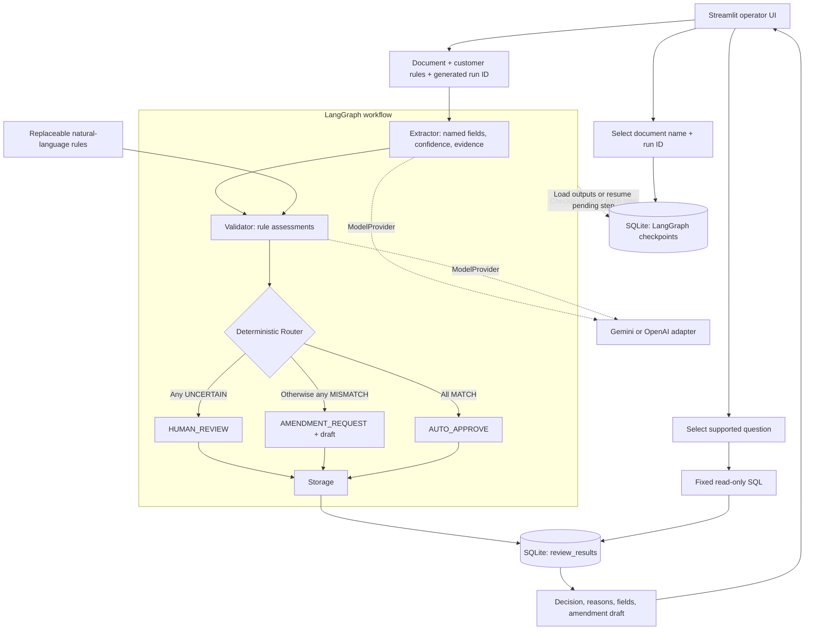

# Nova technical architecture

Nova reviews one PDF or image per run. LangGraph coordinates an acyclic pipeline;
models return structured data, and Python decides the workflow outcome.

The three Router branches illustrate policy; the implementation returns one typed
`RoutingDecision` from a single Router node before proceeding to Storage.
Checkpoint and result tables share a SQLite file but serve different purposes.
The original document and completed outputs are retained in checkpoints, while
`review_results` holds completed reviews for queries. Saving an identical result
again is harmless; conflicting content under the same run ID is rejected.

Each stage receives a provider independently. Gemini extraction can therefore be
paired with GPT validation. Provider adapters own API transport, bounded retries,
and incomplete/refused-response handling. OpenAI uses the Responses API with
strict JSON schema; nullable optional schema properties become required nullable
properties only in the provider request. Pydantic validates the returned payload
against the unchanged domain contract.

Business mismatches never trigger re-extraction. Technical failures stop the graph;
resume executes pending work using current application model settings. The local
saved-run dropdown lists the latest checkpoint per run, including interrupted runs.
Listing scans checkpoint history, which is acceptable for this POC but is not a
paginated production index.

## Timing comparison

Run `scripts/compare_validators.py --report data/image_live_report.json` with API
keys exported. This makes paid requests for GPT-5.4 nano, GPT-5.4 mini, and Gemini
3.6 Flash against identical saved extraction data and rules. It records elapsed
validator time and complete assessments in an ignored JSON report. Extraction is
excluded, so this measures the effect of changing only the Validator. Model-default
reasoning settings are used; retries are disabled. One call per document/model is
a small exploratory comparison, not a latency benchmark or calibrated accuracy
score. Existing Gemini outputs are a comparison reference, not ground truth.

### Measured results — 2026-09-16

| Validator | Median successful call | Results across six images |
| --- | --- | --- |
| GPT-5.4 nano | 5.33 s | 4 HUMAN_REVIEW, 1 AMENDMENT_REQUEST, 1 failed sample |
| GPT-5.4 mini | 5.06 s | 5 AMENDMENT_REQUEST, 1 AUTO_APPROVE |
| Gemini 3.6 Flash | 22.78 s | 5 AMENDMENT_REQUEST, 1 AUTO_APPROVE |

Mini matched the earlier reviewed Gemini mismatch fields and routing across all
six saved extractions. Its median validator latency was about 4.5 times lower
than the freshly measured Flash baseline. This does not imply a 4.5-times-faster
whole pipeline: Gemini extraction time is excluded.

Nano misinterpreted the rule file's reporting instructions as document
requirements, causing extra uncertainty on four samples, including the valid
invoice. It failed local validation on sample03 twice; the second request was a
manual diagnostic rerun after the comparison initially stopped, not an automatic
retry. Its median above excludes those two failed calls (5.81 s and 7.24 s).
The raw diagnostic response is retained only in the ignored comparison report.

Mini is the better candidate for the current prompts on this small sample.
Handwriting transcription ambiguity and exact-name/punctuation tolerance remain
unresolved because all validators consumed the same Gemini extraction. Defaults
have not been switched based on this exploratory evaluation.
