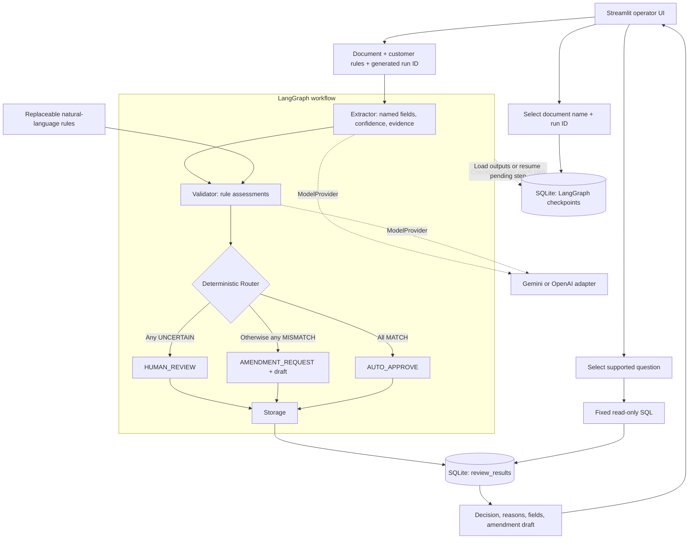

```mermaid
flowchart TD
    UI[Streamlit operator UI] --> Input[Document + customer rules + generated run ID]
    Input --> E
    subgraph Graph[LangGraph workflow]
        E[Extractor: named fields, confidence, evidence] --> V[Validator: rule assessments]
        V --> R{Deterministic Router}
        R -->|Any UNCERTAIN| H[HUMAN_REVIEW]
        R -->|Otherwise any MISMATCH| A[AMENDMENT_REQUEST + draft]
        R -->|All MATCH| OK[AUTO_APPROVE]
        H --> S[Storage]
        A --> S
        OK --> S
    end
    Rules[Replaceable natural-language rules] --> V
    E -. ModelProvider .-> Providers[Gemini or OpenAI adapter]
    V -. ModelProvider .-> Providers
    Graph -. Checkpoint after each step .-> CP[(SQLite: LangGraph checkpoints)]
    S --> Results[(SQLite: review_results)]
    UI --> Saved[Select document name + run ID]
    Saved --> CP
    CP -. Load outputs or resume pending step .-> Graph
    UI --> Query[Select supported question]
    Query --> SQL[Fixed read-only SQL]
    SQL --> Results
    Results --> Display[Decision, reasons, fields, amendment draft]
    Display --> UI
```
